# Práctica - Sitio Malicioso

## José Gilberto Guzmán Gutiérrez.

Para la realización de esta práctica, utilizaremos como ejemplo la plataforma educativa llamada Educa-T, perteneciente a la Universidad Autónoma de Chiapas.

    https://www.educa-t.unach.mx/login/index.php

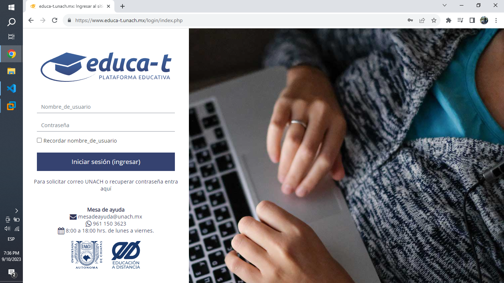

Cabe resaltar que esto se está realizando con fines meramente académicos y nunca se recomienda ni se incentiva a realizar esta acciones por razones éticas y legales. Comprendiendo lo anterior, iniciemos con la práctica.

### 1. Clonación de una página web.

Para ello tenemos puedes utilizar alguna de estas opciones disponibles:

A) **saveweb2zip**: Es una página web la cual genera apartir del enlace que le proporciones, su código de cliente fuente (Frontend), es decir su HTML, CSS, JavaScript, imágenes y fondos.

    https://saveweb2zip.com/es

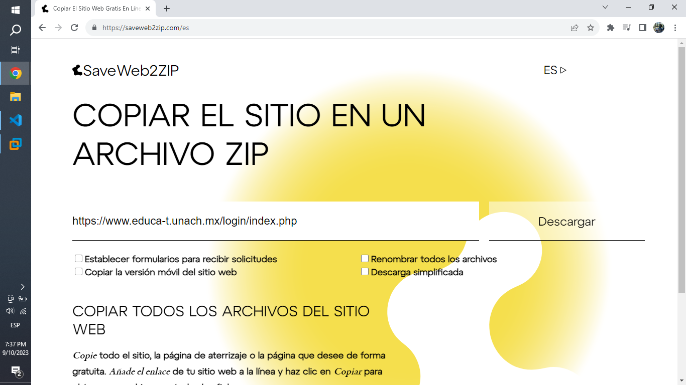

B) **wget**: Esta herramienta permite descargar todo el contenido de una página web, es decir, que además del frontend, nos permite descargar el backend, osea la parte lógica de aplicación.

    wget --mirror --convert-links --wait=2 https://www.educa-t.unach.mx/login/index.php

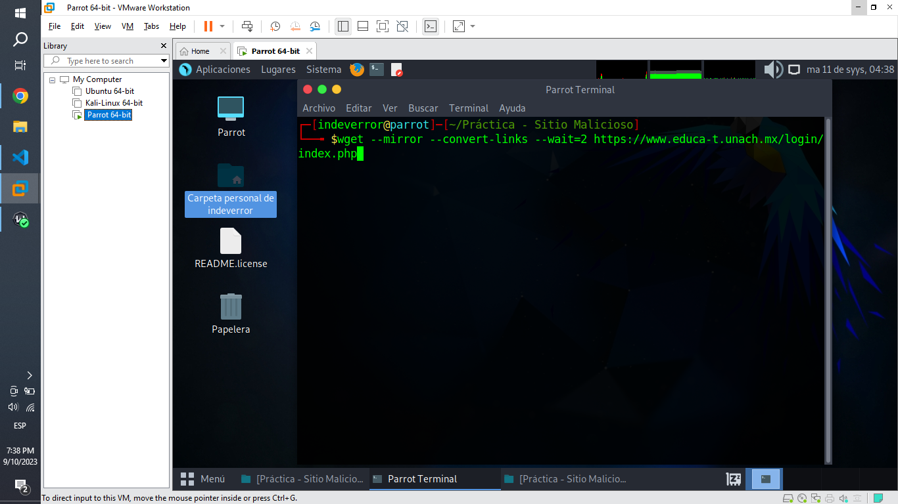

Nota: Esta herramienta támbien esta disponible para Windows https://gnuwin32.sourceforge.net/packages/wget.htm

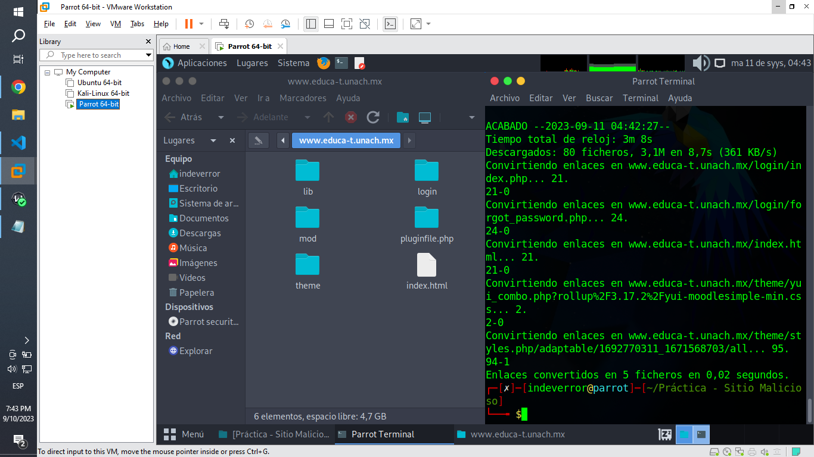

### 2. Modificación del contenido de la página web.

Ahora, nos dirigiremos a nuestra página web clonada, en mi caso por fines de confidencialidad hacia la institución educativa, filtre y elimine todo los códigos disponibles por parte del servidor, por lo cual estaremos trabajando únicamente sobre el código del cliente, osea código es cual está a disposición del usuario desde un inicio.

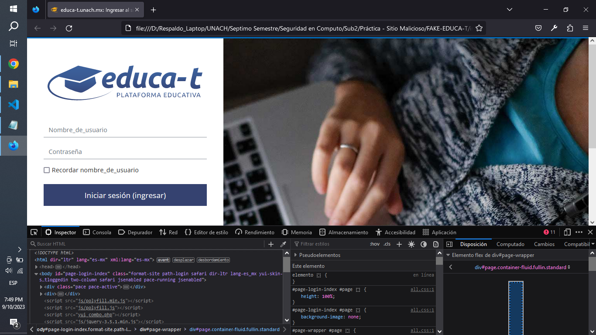

Luego analizaremos detenidamente su código, para después modificarlo.

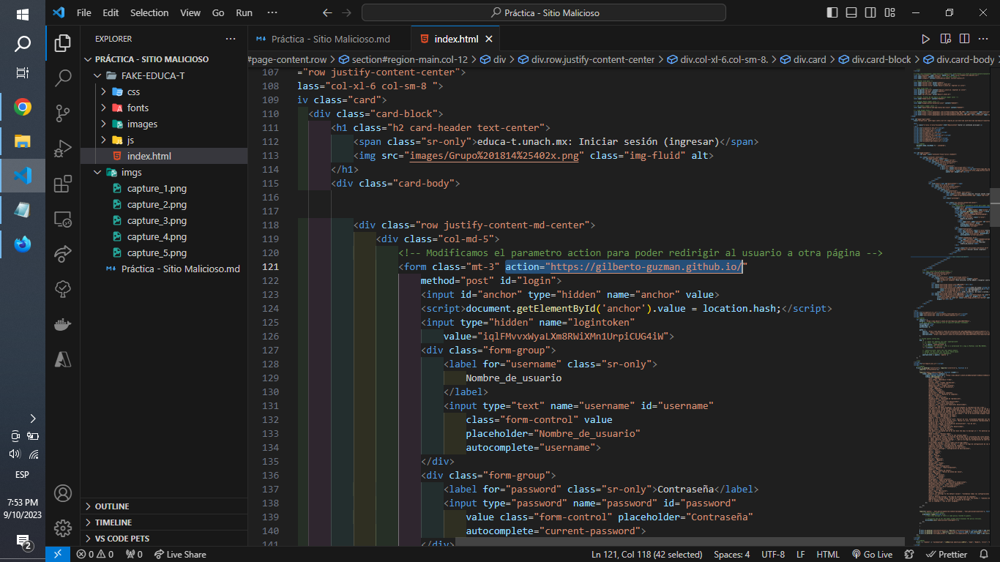

En este caso, cuando el usuario de clic en el botón "Iniciar Sesión (Ingresar)", este sera redirigido a una página web externa.

Usualmente se incrustan IP Loggers como Grabify para la recolección de datos personales de los usuarios, sin embargo para evitar exponer la privacidad del usuario en cuestión, reemplazamos el enlace malicioso y lo cambiaremos por este otro enlace:

    https://gilberto-guzman.github.io/

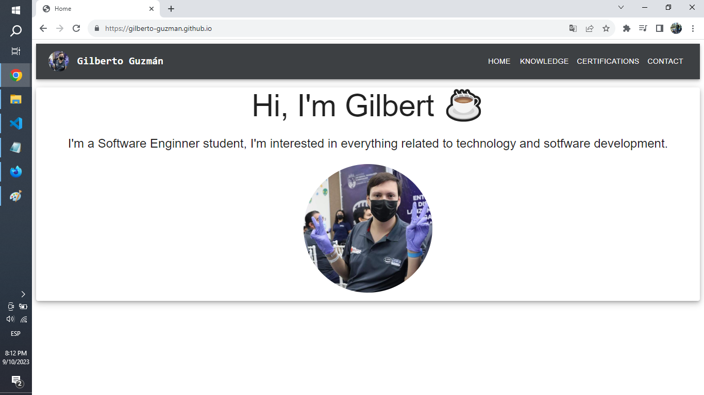

Este es mi portafolio, por si gustan checar mis trabajos.

Cabe resaltar que se utilizó el parámetro action, ya que este no muestra en la esquina inferior izquierda el enlace al cual el usuario será redirigido.

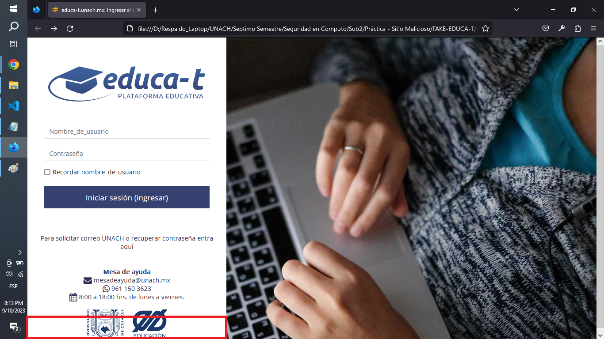

### 3. Subida y despliegue de nuestra página web.

En mi caso utilice Github para subir mi repositorio y la versión beta de Github Actions para desplegar mi página web.

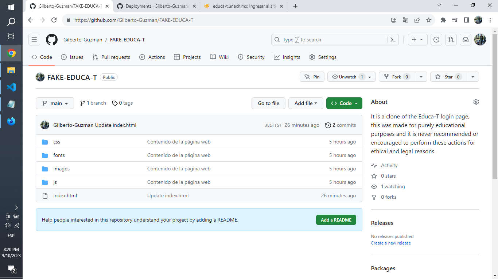
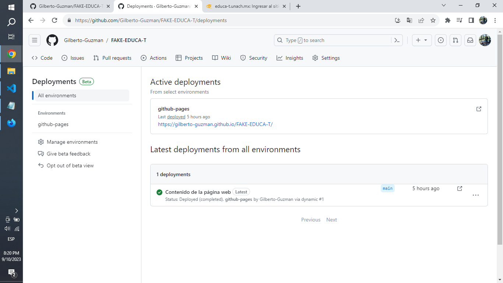

Y estos son los resultados:

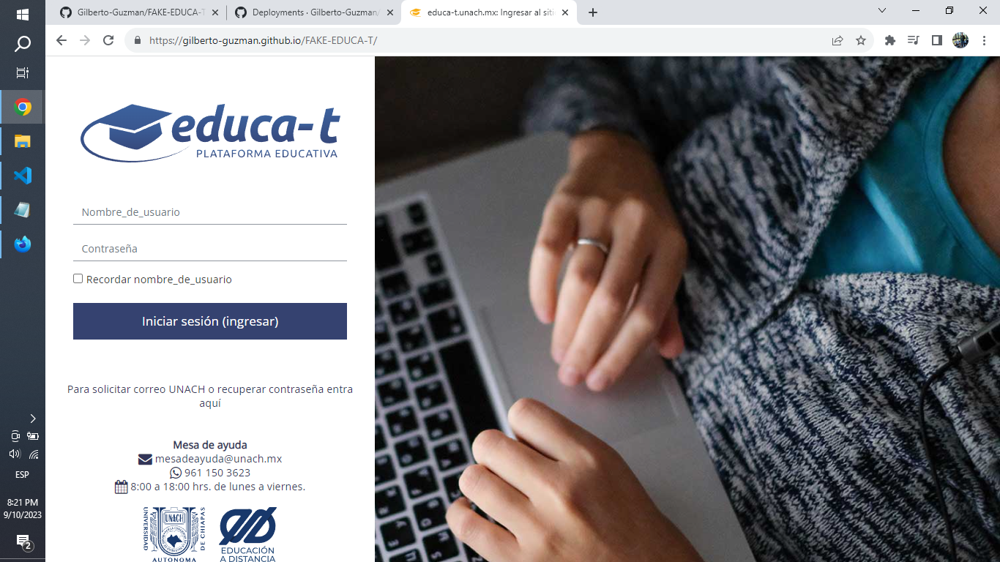

Puedes ahora mismo probar esta página web mediante el siguiente enlace:

    https://gilberto-guzman.github.io/FAKE-EDUCA-T/

o si gustas también visualizar el repositorio completo:

    https://github.com/Gilberto-Guzman/FAKE-EDUCA-T/tree/main

¡ACTUALIZACION IMPORTANTE!

Github Pages ya no permite agregar enlaces pertenecientes a tu misma rama de github.

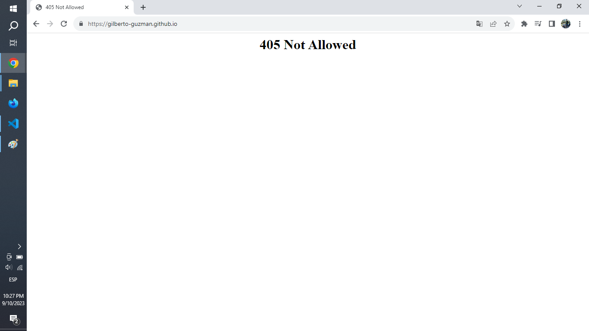

Por lo cual se reemplazara el enlace por un video de youtube:

    https://www.youtube.com/watch?v=dQw4w9WgXcQ

### 4. Creación de un correo de phising.

Adicionalmente, la profesora nos indica que creemos y le enviamos un email de phising.

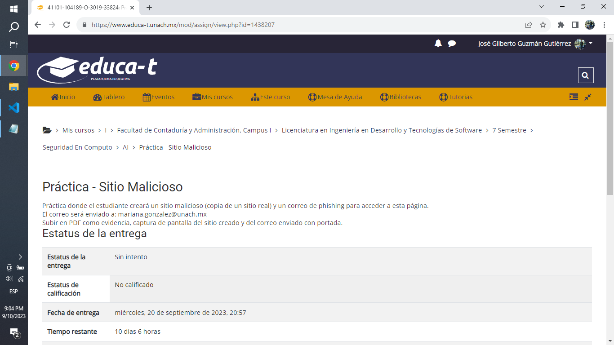

Para ello podemos utilizar herramientas como tempr.email, sin embargo nuevamente, por cuestiones de privacidad, no utilizaremos herramientas de terceros, sino que a modo de "prueba / test" enviaremos directamente nuestro mensaje.

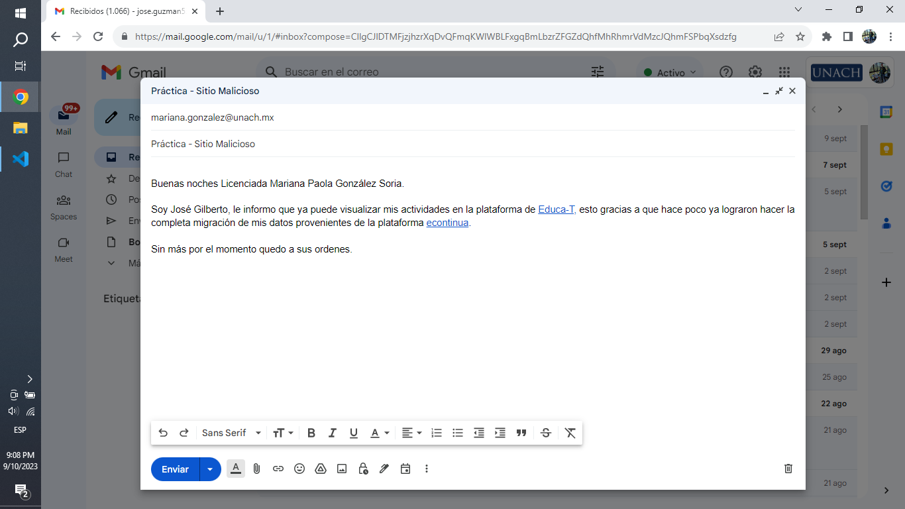
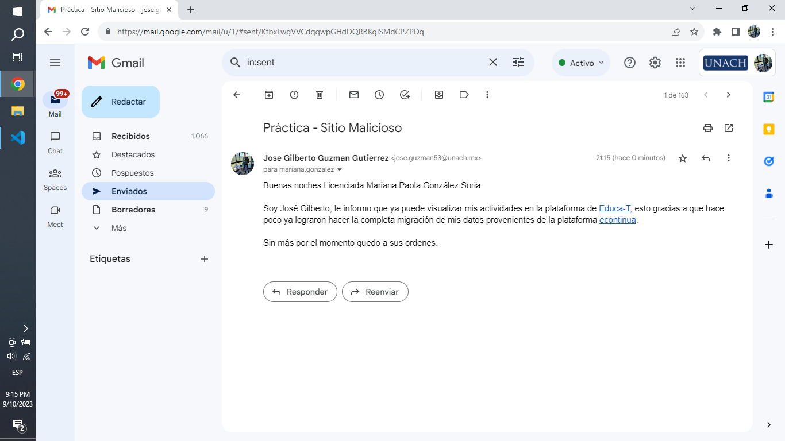
